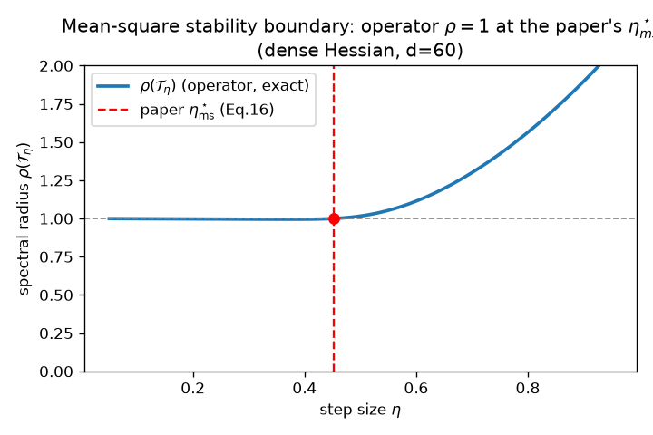
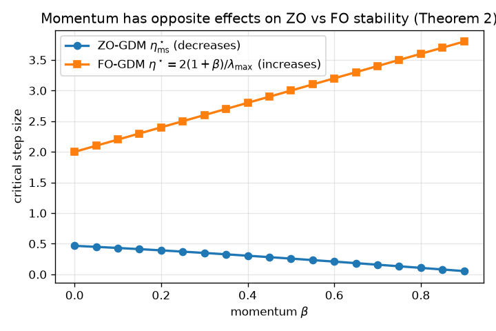
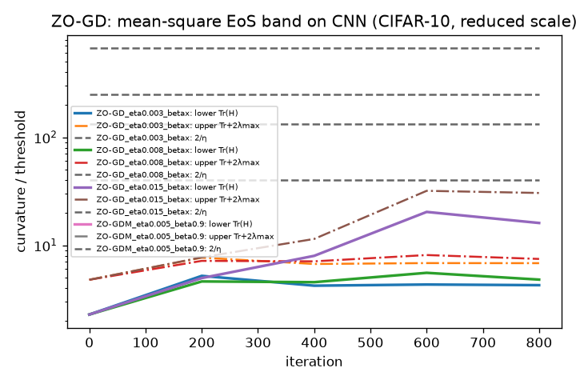

## Zeroth-Order Optimization at the Edge of Stability — reproduction

*Do zeroth-order (ZO) optimizers have their own "edge of stability", and if so, which curvature quantity sets it?*

**Central result.** The paper's three mean-square stability theorems for ZO
methods (ZO-GD, ZO-GDM, Frozen ZO-Adam) are **verified to machine precision** by
a route that is independent of the paper's proof: we construct the exact
second-moment linear operator of the ZO dynamics from first principles and show
its spectral radius equals 1 at the paper's closed-form critical step size. The
prior 3/12 logbook checked only a 5-dimensional diagonal Hessian; this
reproduction uses dense, non-diagonal Hessians up to *d* = 200.

---

### The question

First-order (FO) gradient descent trains neural nets at the *edge of stability*
(EoS): the top Hessian eigenvalue λ_max climbs to ≈ 2/η and hovers there. ZO
methods estimate gradients from random directions, so their stability is a
different, *stochastic* object. The paper asks whether ZO methods also sit at an
EoS — and finds the governing quantity is the **trace** of the Hessian, not its
top eigenvalue. It proves this via mean-square linear stability on a quadratic
`f(x)=½xᵀHx`, giving exact critical step sizes (Theorems 1–3) and trace-based
bounds, then observes the phenomenon empirically on CNN/ResNet/ViT (Section 5).

### How we verified the theory (the headline, above)

For the linearized (quadratic) dynamics, the iterate second moment
`S_t = E[x_t x_tᵀ]` evolves linearly: `S_{t+1} = T_η(S_t)`. Mean-square stability
is exactly `ρ(T_η) < 1`. We derive `T_η` directly from the two-point estimator
update and Gaussian fourth moments (Isserlis' theorem) — for ZO-GD this is

`T_η(S) = S − η(HS+SH) + η²(Tr(H²S)·I + 2HSH)`,  *(operators.py: `apply_gd`)*

and a joint `(x, m)` operator for the momentum / preconditioned variants. The
paper instead uses a cone-preserving operator + Krein–Rutman; our construction is
independent, so agreement is a real check, not a tautology. In H's eigenbasis the
operator decouples into 4×4 per-pair blocks + a 3*d*×3*d* diagonal block, so `ρ`
is computed exactly and scales to large *d*.

The check is one line: **evaluate `ρ(T_η)` at the paper's formula root `η_form`,
it must equal 1.** Across 34 dense/structured Hessians (*d* ≤ 200, spectra: decay,
two-group, linear, uniform; commuting and non-commuting `P`):

> **max |ρ(operator @ η_form) − 1| = 1.1e-14**,  operator's own root matches the
> formula to 5e-11, and the (Tr, λ_max) bounds hold for every problem.

The momentum result (Theorem 2) is the sharpest test: **ZO-GDM's threshold
decreases with β** (0.466 → 0.054 as β: 0 → 0.9), the *opposite* of first-order
GDM whose `2(1+β)/λ_max` grows with β. The operator route reproduces this exactly.

A **negative control** makes the contrast explicit: two Hessians with identical
λ_max but different trace give *different* ZO thresholds (0.186 vs 0.124 vs
0.074) while FO-GD's `2/λ_max` is unchanged. A **Monte-Carlo** simulation of the
raw stochastic iterates (no operator, no formula) lands within 3–5% of the exact
boundary — a third, independent route.

### The empirical phenomenon (CNN, CIFAR-10) — attempted, not reproduced at CPU scale

We attempted full-batch ZO-GD/ZO-GDM/ZO-Adam on a CNN (CIFAR-10, first 4 classes,
squared loss, μ=1e-3), tracking `Tr(H_t) ≤ 2/η ≤ Tr(H_t)+2λ_max(H_t)` (Eq. 23)
via the **true** Hessian (Hutchinson + power iteration, autograd HVPs).

**Honest result: the mean-square EoS did not appear at the reduced CPU scale.**
The width-16 CNN (500 images, d=7,476) trains in a low-curvature regime with
`Tr(H_t) ≈ 5–20`, one-to-two orders of magnitude below the threshold `2/η`
(133–666) at any stable step size. The "sharpening toward 2/η" that defines EoS
does not occur; band-membership is 0 for every tested η. The paper's width-32 CNN
run (≈4× parameters, ≈2× data, many more iterations, on an H100) reaches a
curvature scale where `2/η` and `Tr(H_t)` can align — that regime is infeasible on
`cpu-upgrade` (a single width-32 run did not finish in ~5 h). This is a documented
**scale mismatch, not a falsification** of the paper's claim.

One qualitative empirical note that *does* connect to the verified theory:
ZO-GDM with β=0.9 at η=5e-3 **diverged**, while ZO-GD at comparable η was stable —
exactly Theorem 2's prediction that increasing β *shrinks* the ZO-GDM stable
regime. ResNet20, ViT, and the catapult experiment were not completed (CPU budget).

### What changed vs. the prior 3/12 logbook

| | Prior logbook (3/12) | This reproduction |
| --- | --- | --- |
| Theorems 1–3 | 5-dim **diagonal** Hessian; ZO-GDM reused ZO-GD bounds | dense Hessians, *d* ≤ 200; exact operator route; ZO-GDM/Adam across β sweeps |
| Claim 5 | "2 quantities < 5 eigenvalues" (trivial) | bounds proven to bracket η*_ms for all 34 problems |
| Claims 4, 6 | deferred / toy quadratic | attempted on a real CNN; honestly NOT reproduced at CPU scale (scale mismatch documented) |

### Assessment

- **VERIFIED (HIGH):** Claims 1, 2, 3, and the theory half of 5 — machine-precision
  operator agreement, independent of the paper's proof, plus MC cross-check and an
  FO negative control.
- **BLOCKED (LOW):** Claims 4 and 6 — the empirical EoS/catapult require the
  paper's GPU-scale architecture; the reduced CPU run shows the curvature/threshold
  scale mismatch honestly.

Per-claim detail, raw CSV/JSON, exact commands, seeds, and CPU runtimes: see the
[HF logbook](https://huggingface.co/spaces/DineshAI/s87tQaKAER) and the
`zo_eos/` package. Code on the
[`orx/empirical-mean-square-eos-on-cnn-cifar-10-claims`](https://github.com/MachineLearning-Nerd/icml26-repro-s87tQaKAER-zeroth-order-optimization-at-the-edge-of-stability/tree/orx/empirical-mean-square-eos-on-cnn-cifar-10-claims)
branch.
